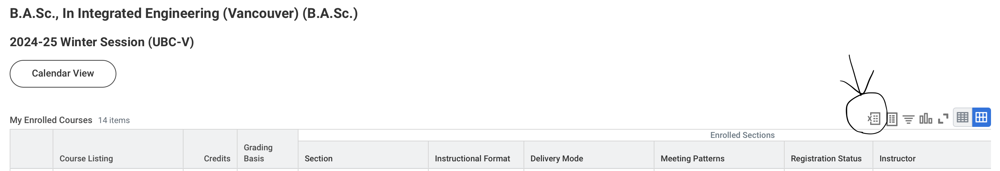

# XLSX_to_ICS

## Description 
This prorgam converts the excel file provided by the ubc workday website into an ICS file for easy importing to your calendar. Currently only works for MACOS if you use the executable file. 

## Instructions (Only MACOS 😔)
- Download this repository. Either clone it or download a zip file. 
[CLICK HERE TO DOWNLOAD ZIP](https://github.com/alexm35644/XLSX_to_ICS/archive/refs/heads/main.zip)
- Download your schedule from workday (the excel file). It is found in view my courses. There is a button to donwload excel file on the right above the calendar. 

- open up the folder titled "OPEN_THIS". Click on the file inside called SCHEDULE_GEN. Give it a few seconds to load. 
- One a window pops up, select the button, select the file of your schedule (should be a .xlsx file), and click okay
- Click Convert 
- a schedule.ics file should pop up in the same folder as SCHEDULE_GEN. 
- You can upload this file to the calendar of your choice. 
### APPLE CALENDAR 
If you are on mac, when you click on the file it should open up the default calendar app. It will ask you which calendar you want to add the file to. Add it to the calendar of your choice. 
### GOOGLE CALENDAR 
Look up google calendar on your browser. Go to settings (you can find it on the top right). Select import & export. Import the schedule.ics file. 
